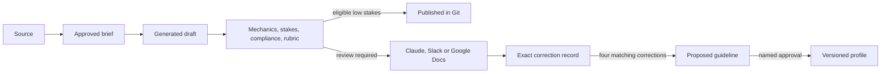

# Contentino

Contentino is an internal content system built around a versioned brand profile. It generates
content, scores it before a person sees it, routes it according to score and stakes, and turns
human edits into proposed rules.

It solves two different problems:

- Low-stakes work can move into Git without a second person reviewing it.
- Higher-stakes work reaches a person with the brief, score and exact evidence attached.

This prototype is built for Lemonade as part of a GenAI Lead challenge. It ships two complete
content streams: product micro-copy and external communications.

## The path



Publishing means moving a scored artifact from `content/drafts` to `content/published`. The
prototype never posts to a public channel.

## What is built

- A valid Codex plugin with seven skills: make a brief, write both content types, score,
  review, cluster corrections, and add a content type.
- A shared Lemonade profile, individual voice layer, content-type examples and criteria.
- Deterministic mechanics checks followed by model-graded stakes, compliance and rubric
  checks. Any veto, zero criterion, stale score or ineligible stakes ceiling blocks publishing.
- A three-attempt regeneration cap and a $50 budget guard that reserves estimated cost before
  each paid call.
- Local and GitHub storage adapters behind one interface. A hosted logical run becomes one Git
  commit with expected-SHA conflict checks.
- Claude, Slack and Google Docs review adapters that all create the same correction record.
- Google Drive transcript polling with source-id idempotency.
- A correction clustering and approval path. Four matching corrections are required before a
  guideline can be proposed.
- A read-only evidence dashboard with real ledger, profile and rubric data. It has honest empty
  states when no live runs exist.

## Safety rules

Content cannot publish unless its scorecard exists, matches the current file hash, passes
compliance, contains no zero criterion, clears 9 out of 10 and fits the content type's
auto-publish ceiling. External communications declare a ceiling of `none`, so they always enter
review.

The same publish gate is enforced in the storage API and by the local Claude project hook.
Reviewed revisions are rescored, and a reviewer-introduced compliance violation changes the
piece to blocked.

## Evidence

Run all local checks:

```bash
npm install
npm run check
npm run test:e2e
npm run build
```

Run the deterministic product demo:

```bash
npm run demo
```

Current verified evidence:

- 45 unit, contract, workflow and adapter tests pass.
- 5 browser checks pass across desktop Chromium and mobile WebKit; one desktop-only mobile
  assertion is skipped by design.
- The 47-item rubric re-check reproduces every encoded answer. Real Lemonade copy averages
  9.49, off-brand copy 4.50, a 4.99-point gap.
- The production Next.js build completes.
- `npm audit --audit-level=high` reports zero vulnerabilities.
- The deterministic demo records seven runs and five revisions in a temporary ledger and proves
  the complete workflow without spending API budget.

See [eval/demo-run.md](eval/demo-run.md) for what the demo proves and what remains mocked.

## Run locally

The project requires Node 24.

```bash
cp .env.example .env.local
npm install
npm run dev
```

The dashboard opens at `http://localhost:3000`. Local storage points at the repository by
default. Model-backed commands require `ANTHROPIC_API_KEY`.

Useful commands:

```bash
npm run contentino -- write-microcopy --request "CTA to finish a quote" --by stav
npm run contentino -- make-brief --source ./transcript.txt --source-id drive-file-id
npm run contentino -- approve-brief --path content/briefs/<id>.md --by Stav
npm run contentino -- write-external --brief content/briefs/<id>.md --by stav
npm run contentino -- publish --draft content/drafts/<id>.md
```

## Hosted configuration

Hosted workflows set `CONTENTINO_STORAGE=github` and provide a fine-grained GitHub token with
contents access to one private repository. Slack requests require a valid signature and the
configured channel. The Drive cron requires a bearer secret. Google service-account access is
not implicit: the watched folder and review documents must be shared with that account.

Vercel preview protection remains on. Slack and cron requests add Vercel's automation bypass
header so protection does not disable the webhooks.

Every required variable and model override is documented in [.env.example](.env.example).

## Repository map

- `profile/` - shared voice, stakes, compliance, mechanics, people and content types
- `skills/` - the seven plugin workflows
- `workflows/` - application orchestration
- `gate/` - mechanics, scoring, routing and publishing enforcement
- `lib/adapters/` - Claude, Slack, Drive and Google Docs transports
- `lib/storage.ts` - the only persistence seam
- `metrics/` - ledger, baseline assumptions and KPI definitions
- `eval/` - rubric evidence and the deterministic demo record
- `app/` - read-only dashboard and webhook routes

## Remaining live evidence

The implementation is complete locally. These checks require account access and are not claimed
as done:

- Real Anthropic scoring against the answer key and actual cost capture.
- One installed Slack thread and one Google Drive/Docs round trip.
- GitHub-backed hosted persistence and the protected Vercel preview.
- Three real, approved internal-comms examples. Fixture examples prove the extension contract
  but are not allowed into the live profile.
- Stav's blind 20-item human calibration.

The product choices and rejected alternatives are in [DECISIONS.md](DECISIONS.md). The build
record is in [PROCESS.md](PROCESS.md), and the final argument is in [WRITEUP.md](WRITEUP.md).
