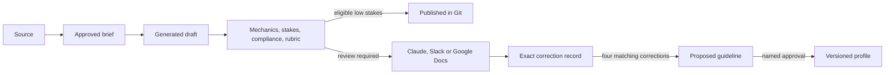

# Contentino

Contentino is an internal content system built around a versioned brand profile: a folder
of markdown that defines how Lemonade writes. It generates content, scores every piece
against that profile before a person sees it, routes it by score and stakes, and turns
reviewer corrections into proposed profile rules - so the system tightens with use.

It solves two problems that are not the same problem:

- **Remove overhead.** Low-stakes content that scores high enough publishes itself, with
  nobody watching.
- **Make people faster on the work that matters.** Not faster at drafting - faster to
  *approved*. Review, not drafting, is the bottleneck, so every draft arrives with its
  brief, score and per-criterion evidence attached.

Built for Lemonade as part of a GenAI Lead challenge, with two complete content streams:
product micro-copy and external communications.

## Try it in five minutes

The plugin ships a guided tour. In Claude (web or desktop):

1. Settings → Plugins → add this repository as a marketplace, install **Contentino engine**.
2. Settings → Connectors → Add custom connector, paste the Contentino gate URL
   (provided with the submission - the link carries its own key).
3. Open a new chat and type `/lemonade-demo`.

The tour makes real content: a button label that scores 10 and publishes itself, and an
announcement built from Lemonade's actual Q2 2026 earnings call that is held for human
review at any score. Both runs land in the live evidence dashboard (URL and password also
provided with the submission), with score, outcome and cost in cents.

## The path every piece takes



Publishing means moving a scored artifact from `content/drafts` to `content/published`.
The prototype never posts to a public channel.

## The rules that cannot be bypassed

- Nothing ships unscored. A draft publishes only if its scorecard exists, matches the
  current file hash, passes the compliance veto, has no criterion at zero, clears 9 out
  of 10 and fits its content type's auto-publish ceiling.
- Only the content type can raise the stakes ceiling. External communications declare a
  ceiling of `none`, so they always reach a person - a 10 buys a faster review, never a
  shortcut past one.
- The model classifies each piece's stakes, but that classification can move a piece
  into review, never out of it.
- In the Claude surface, the model drafts but never judges its own work: every draft is
  submitted to the production gate, which scores it, stores it and writes the ledger.

## Where it runs

Three surfaces, one engine underneath. No new UI to learn:

- **Claude** - the `/contentino` skill routes any request (a button label, an
  announcement, a pasted transcript) through the right flow and the production gate.
- **Slack** - mention the bot to request content, approve briefs with a button, give
  feedback in the thread; revisions are rescored on the spot.
- **Google Drive** - a transcript dropped in the watched folder becomes a brief in
  Slack with an approve button.

The only page built is a read-only evidence dashboard: ledger, scores, costs, and the
profile itself. Trust in the system is a tracked number (revisions per approval), not a
promise.

## Model choices as cost decisions

A $50 budget bounds the build, so models are assigned per job: Opus 5 writes briefs,
Sonnet 5 writes content and runs the compliance veto, Haiku 4.5 classifies stakes and
scores the rubric criteria, and mechanics are checked in code for free - a mechanical
block costs nothing because it runs before any paid call. The brand profile is identical
on every call and is prompt-cached per model. A budget guard reserves estimated cost
before each paid call.

## Evidence

```bash
npm install
npm run check      # lint, typecheck, unit and workflow tests
npm run test:e2e   # browser checks against the dashboard
npm run build
```

- 64 tests across 16 files pass, covering the gate, storage, workflows and surfaces.
- The 47-item rubric re-check reproduces every encoded answer: real Lemonade copy
  averages 9.49, off-brand copy 4.50.
- `npm run demo` replays the complete workflow deterministically without spending API
  budget; see [eval/demo-run.md](eval/demo-run.md) for what it proves.
- All three surfaces verified against production: Slack round trips with buttons and
  feedback, Claude drafting judged by the gate over MCP, Drive transcript to approved
  brief. The acceptance sequence is in [TEST-PLAN.md](TEST-PLAN.md).

## Run locally

Requires Node 24.

```bash
cp .env.example .env.local
npm install
npm run dev
```

The dashboard opens at `http://localhost:3000`. Storage points at the repository by
default; model-backed commands need `ANTHROPIC_API_KEY`. Every variable is documented in
[.env.example](.env.example).

Hosted, the same code runs on Vercel with `CONTENTINO_STORAGE=github`: logical runs
become Git commits with conflict checks, Slack requests are signature-verified, the
Drive cron carries a bearer secret, and the dashboard sits behind a shared password.

## Repository map

- `profile/` - shared voice, stakes, compliance, mechanics, people and content types
- `skills/` - the nine plugin skills, including `/contentino` (the front door) and
  `/lemonade-demo` (the guided tour)
- `workflows/` - application orchestration
- `gate/` - mechanics, scoring, routing and publishing enforcement
- `lib/adapters/` - Claude, Slack, Drive and Google Docs transports
- `lib/storage.ts` - the only persistence seam; swapping git for a real content platform
  is a change in one file
- `metrics/` - ledger, baseline assumptions and KPI definitions
- `eval/` - rubric evidence and the deterministic demo record
- `app/` - the dashboard, the gate endpoints and the webhook routes

## The paper trail

This project was built in five days and submitted with its open items listed, not hidden:
the honest remainder is at the bottom of [PLAN.md](PLAN.md), and [TEST-PLAN.md](TEST-PLAN.md)
names the three flows not yet ready to test. The verification claims above cover what was
actually run against production, nothing more.

This repo is judged on product thinking, not just code, and the thinking is a
deliverable: every product and build decision, with the options that were rejected, is
in [DECISIONS.md](DECISIONS.md). The build record - including what went wrong and how it
was found - is in [PROCESS.md](PROCESS.md). The final argument is in
[WRITEUP.md](WRITEUP.md).
